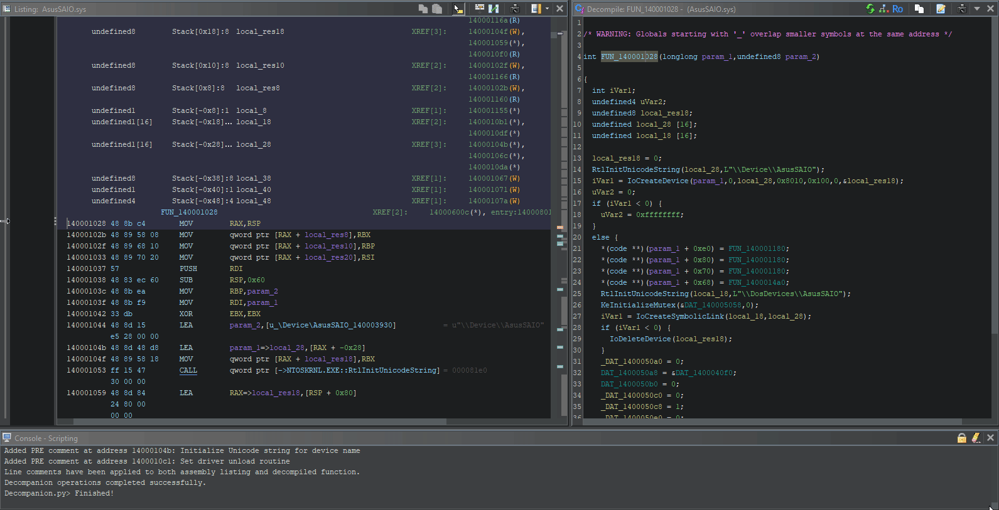

# Decompanion

Decompanion is an __extension for Ghidra that leverages AI to assist in reverse engineering and binary analysis__.

It uses Anthropic's Claude API to provide intelligent suggestions for function and variable renaming, type inference, and code explanations. Decompanion prioritizes customized automation by allowing the user to edit each suggestion at each step of the way, without having the model forcefully modify the Ghidra project. This ensures that users maintain control over their reverse engineering workflows, tailoring suggestions to their specific needs and preferences.

## Features

- **AI-assisted function renaming**: Provides meaningful names for unidentified functions based on context.
- **Variable renaming & type inference**: Suggests new names and infers variable types to enhance code clarity. Invalid types are highlighted to the user before retyping.
- **Function code explanations**: Generates detailed explanations for decompiled functions.
- **Caller context analysis**: Incorporates the decompiled code of calling functions to provide additional context, improving the accuracy of AI-driven suggestions.
- **Line-by-line comments**: Adds insightful comments to critical sections of the code for better understanding.
- **User-friendly interface**: Interactive GUI for reviewing AI-generated suggestions and customizing actions.

## Prerequisites

- __Ghidra `>= 11.1.2`__. You can download the latest version of Ghidra [here](https://ghidra-sre.org).
- __Claude API key__. You can obtain one [here](https://www.anthropic.com/api).

> [!NOTE]
> Ghidra ships with a Python 2.7.3 extension system based on Jython, so Decompanion is written with this in mind.

## Installation

1. Clone this repository.

2. Add the main `Decompanion` directory in Ghidra:
   - Go to `Window` > `Script Manager`
   - In the `Script Manager` window, go to `Manage Script Directories`
   - In the `Bundle Manager` window, add the `Decompanion` directory
   - The script will be populated inside the `Script Manager` window. Enable it by checking the `In Tool` box.

3. Add your Claude API key to Ghidra's preferences:
   - When you run the Decompanion extension for the first time, it will prompt you to enter your Claude API key. Once entered, the key will be stored in Ghidra's preferences for future use.

## Usage

1. Open your binary in Ghidra and analyze it.

2. Navigate to the function you want to analyze.

3. Press `SHIFT + R`

4. Follow the on-screen prompts to:
   - Select the Claude model to use
   - Choose the actions to perform (rename/retype, explain, add comments)
   - Review and edit the generated prompt (if enabled)
   - Select caller functions to include for additional context
   - Review and apply the AI-generated suggestions

## Configuration

You can modify the `config.py` file to customize various aspects of Decompanion:

- `CLAUDE_MODELS`: List of available Claude models. By default, it uses `claude-3-5-sonnet-20240620` and will skip prompting for model selection if there is only one model in this list.
- `SKIP_PROMPT_CONFIRMATION`: Set to `True` to skip the prompt review step. By default, it is set to `False` so users can modify each prompt to their preferences.
- `PROMPTS`: Customize the default prompts sent to the Claude API for each action.

## References

Decompanion accesses the [Swing library](https://docs.oracle.com/javase/8/docs/api/javax/swing/package-summary.html) for its GUI, and utilizes the [Ghidra API](https://ghidra.re/ghidra_docs/api/) for Ghidra-specific functionality.

## Contributing

Contributions are welcome! Please feel free to submit a Pull Request. Decompanion was made with Claude in mind but aims to integrate other AI APIs in the future.
